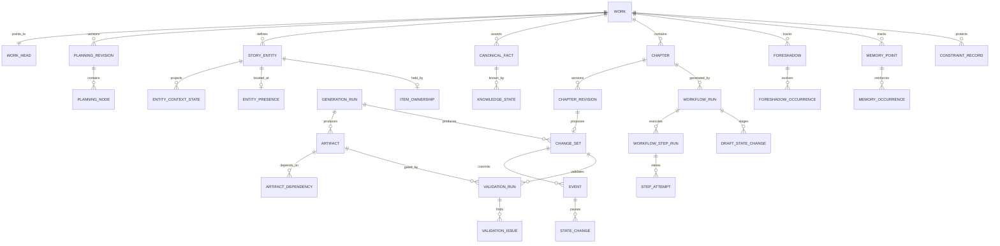

# 核心数据模型

> 本文是 [系统与项目设计](PROJECT_DESIGN.md) 的数据设计附件。  
> 状态：Draft v0.4；首批基础表已固化在 `0001_core_foundation`，写作工作台字段固化在 `0004_writing_workspace`。

## 1. 建模原则

1. 所有业务主键使用 UUID，展示编号如 `MEM-017` 只作为作品内可读编码。
2. 所有租户根表和高频查询子表带 `work_id`；纯关联表可通过同作品复合外键继承，但不得形成跨作品引用。
3. 正式事件和状态变化只追加；更正通过补偿记录表达。
4. 地点、存亡、唯一物品归属和能力等硬状态使用类型化投影；JSONB 当前状态只承载柔性字段或上下文聚合读模型。
5. 模型产物先进入 proposal/staging 表，通过校验后才进入 canonical 表。
6. 灵活内容使用 JSONB，身份、硬状态、顺序、引用和并发控制使用关系字段。
7. 聚合型 JSONB 文档携带 `schema_version`；标量 JSONB 值由字段、谓词或事件类型注册表指定 schema。
8. 时间同时保存故事时间、叙述顺序和系统提交时间。
9. 所有修改使用乐观锁 `version`，所有长任务使用不可变基线快照。
10. 表中枚举在实现时可用受约束的 `text`，避免 PostgreSQL enum 难以演进。
11. 原始模型响应、解析后的候选产物和通过门禁的正式输入分开保存；下游任务不得直接消费原始响应。
12. MVP 正文和证据文本使用 PostgreSQL `text`，与规范事实共享事务；对象存储用于原始响应、导入材料和冷大对象。
13. 所有派生产物记录完整输入依赖、版本和哈希，以支持精确失效与可复现生成。

### 1.1 首版迁移边界

首批基础迁移先固化作品/章节、不可变产物、工作流运行与步骤、产物依赖、精确上下文快照、模型运行、章节修订、变更提案、事件类型注册表、规范事件、唯一物品归属投影、语义记忆和事务 outbox。规范事件通过 `(event_type, projector_version)` 复合外键绑定已注册 payload schema 与投影器。规划树、完整人物/地点/知识投影、伏笔与锁定表仍以本文目标模型为准，后续按可运行纵切分别迁移，不以一个巨型首迁移一次建空表。

语义向量在首版使用无固定维度的 `vector` 列，并额外记录模型、维度和内容哈希；这是可重建派生索引，不是事实源。因为无固定维度列不能建立通用 HNSW 索引，进入规模化召回前应按嵌入配置建立定维分区或专用表，再在分区内建索引。无论是否建索引，查询必须先限制作品、命名空间、正式提交可见区间和防剧透章节边界。

## 2. 关系概览



## 3. 表设计

以下类型是逻辑类型；实现迁移时统一使用 `timestamptz`、`uuid`、`jsonb` 和明确的检查约束。

### 3.1 作品与规划

#### `works`

| 字段 | 类型 | 约束/说明 |
| --- | --- | --- |
| id | uuid | PK |
| owner_id | uuid | NOT NULL，所有者/租户 |
| title | text | NOT NULL |
| description | text | 作品简介，可空 |
| genre | text | 单题材模板标识 |
| language | text | 默认 `zh-CN` |
| target_chapters | int | MVP 最大 100 |
| target_words_per_chapter | int4range | 目标字数区间 |
| status | text | `DRAFT/ACTIVE/ARCHIVED` |
| settings_json | jsonb | MVP 的核心卖点、主题、全文主线、分卷大纲、结局约束、故事圣经、文风与禁写约束；后续迁入版本化规划节点后仅保留非规范配置 |
| version | bigint | 乐观锁 |
| worker_id / lease_expires_at | text/timestamptz | 本地 worker 认领身份与崩溃恢复租约 |
| created_at / updated_at | timestamptz | 审计时间 |

#### `work_heads`

这是每部作品唯一的轻量并发控制行，提交章节时使用 `SELECT ... FOR UPDATE` 锁定。

| 字段 | 类型 | 约束/说明 |
| --- | --- | --- |
| work_id | uuid | PK、FK works |
| commit_seq | bigint | 已提交事件的作品内序号，初始为 0 |
| canonical_state_version | bigint | 每次规范提交递增，供 `change_set` 校验基线 |
| active_plan_revision_id | uuid | 当前已批准规划修订 |
| last_committed_chapter_no | int | 便捷边界，不代替章节查询 |
| updated_at | timestamptz | 审计时间 |

#### `planning_revisions`

每次规划或局部重规划生成一个完整规划快照。100 章 MVP 直接复制规划节点，换取简单、可靠的版本比较。

| 字段 | 类型 | 约束/说明 |
| --- | --- | --- |
| id | uuid | PK |
| work_id | uuid | FK works |
| revision_no | int | 作品内递增、唯一 |
| parent_revision_id | uuid | 来源修订，可空 |
| replan_from_chapter | int | 局部重规划起点，可空 |
| reason | text | 重规划原因或用户指令 |
| status | text | `DRAFT/VALIDATING/APPROVED/ACTIVE/SUPERSEDED/REJECTED` |
| created_by / approved_by | uuid | 人工或系统身份 |
| created_at / approved_at | timestamptz | 审计时间 |

任一作品只能有一个 `ACTIVE` 修订；切换活动修订必须与 `work_heads.active_plan_revision_id` 在同一事务中完成。

#### `planning_nodes`

| 字段 | 类型 | 约束/说明 |
| --- | --- | --- |
| id | uuid | PK |
| work_id | uuid | FK works |
| revision_id | uuid | FK planning_revisions |
| logical_key | uuid | 同一逻辑节点跨修订保持不变，供锁定和差异比较 |
| parent_id | uuid | 自引用；作品节点可为空 |
| node_type | text | `WORK/VOLUME/ARC/EVENT/CHAPTER/SCENE` |
| display_code | text | 作品内唯一，如 `VOL-01` |
| ordinal | numeric | 同级排序；支持中间插入 |
| title | text | NOT NULL |
| intent | jsonb | 含 schema_version 的原始目标与约束 |
| forecast | jsonb | 含 schema_version 的当前未来预测，可重规划 |
| actual | jsonb | 含 schema_version 的已提交内容派生结果 |
| status | text | `DRAFT/APPROVED/ACTIVE/DONE/ABANDONED` |
| effective_from_chapter | int | 修订生效边界 |
| version | bigint | 乐观锁 |
| created_by / created_at / updated_at | ... | 审计字段 |

约束与索引：

- `(revision_id, display_code)` 和 `(revision_id, logical_key)` 唯一；
- `(revision_id, parent_id, ordinal)` 索引；
- 父节点和子节点必须属于同一作品和同一规划修订；
- 应用层校验合法父子类型，例如 `VOLUME → ARC/EVENT`；
- `actual` 不由重规划模型直接写入，只由提交后汇总任务更新。

#### `planning_dependencies`

| 字段 | 类型 | 说明 |
| --- | --- | --- |
| work_id | uuid | 作品 |
| revision_id | uuid | 所属规划修订 |
| from_logical_key / to_logical_key | uuid | 跨修订稳定的依赖端点 |
| dependency_type | text | `REQUIRES/SETS_UP/PAYS_OFF/BLOCKS/TRANSFORMS` |
| strength | text | `HARD/SOFT` |
| rationale | text | 可解释原因 |

唯一键为 `(revision_id, from_logical_key, to_logical_key, dependency_type)`。当前修订的两个逻辑键都必须存在；`REQUIRES` 子图不得成环。

### 3.2 实体、事实与规则

#### `story_entities`

统一保存稳定身份，不把易变状态塞进人物卡。

| 字段 | 类型 | 说明 |
| --- | --- | --- |
| id | uuid | PK |
| work_id | uuid | FK |
| entity_type | text | `CHARACTER/LOCATION/ITEM/FACTION/ABILITY/RELATIONSHIP/CONCEPT` |
| display_code | text | 作品内唯一，如 `CHAR-001` |
| canonical_name | text | 规范名 |
| aliases | text[] | 别名，仅用于检索；重名仍靠 ID 区分 |
| profile | jsonb | 含 schema_version 的出身、外貌稳定特征、人物核心等 |
| status | text | `ACTIVE/RETIRED`，不等于人物生死 |
| version | bigint | 乐观锁 |
| created_at / updated_at | timestamptz | 审计字段 |

人物之间需要长期跟踪的关系建成 `RELATIONSHIP` 实体。参与方属于身份关系，不能藏在 `profile` JSONB 中；信任、亲密、敌意、债务等易变值则进入柔性状态投影。

#### `relationship_members`

| 字段 | 类型 | 说明 |
| --- | --- | --- |
| relationship_id | uuid | FK，必须指向 `RELATIONSHIP` 实体 |
| member_entity_id | uuid | FK，关系参与方 |
| member_role | text | 如 `PARTY_A/PARTY_B/MENTOR/STUDENT` |
| ordinal | int | 多方关系的稳定顺序 |

主键 `(relationship_id, member_entity_id, member_role)`。关系方向、唯一性和允许参与方数量由关系类型规则约束。

#### `fact_predicate_definitions`

规范事实的谓词必须注册，避免 `predicate + object_value JSONB` 演化成无类型键值仓库。

| 字段 | 类型 | 说明 |
| --- | --- | --- |
| code | text | PK，如 `identity.is`、`origin.place` |
| subject_entity_type | text | 允许的主体类型 |
| value_kind | text | `ENTITY/STRING/NUMBER/BOOLEAN/JSON` |
| object_entity_type | text | `ENTITY` 值允许的对象类型，可空 |
| cardinality | text | `ONE/MANY` |
| temporal_policy | text | `STATIC/INTERVAL/POINT` |
| value_schema | jsonb | 标量 JSON Schema，可空 |
| conflict_policy | text | 互斥、可并存或自定义规则 |
| projector_key | text | 可选类型化投影处理器 |
| version | int | 定义版本 |

#### `canonical_facts`

事实应尽量原子化，例如“林舟是玄门继承人”和“林舟知道自己是继承人”是两条不同语义，后者应进入知识状态。

| 字段 | 类型 | 说明 |
| --- | --- | --- |
| id | uuid | PK |
| work_id | uuid | FK |
| subject_entity_id | uuid | 可空，事实主体 |
| predicate_code | text | FK fact_predicate_definitions |
| object_entity_id | uuid | 实体型值，可空 |
| object_value | jsonb | 标量型值，可空 |
| truth_status | text | `CANONICAL/DISPUTED/RETRACTED` |
| story_order_min / story_order_max | numeric | 可排序的规范化故事时间范围，可空 |
| time_precision | text | `EXACT/RANGE/PART_OF_DAY/RELATIVE/UNKNOWN` |
| time_expression | jsonb | 原始叙事时间表达和日历信息 |
| anchor_event_id | uuid | 相对时间锚点，可空 |
| source_event_id | uuid | 产生或确认该事实的事件 |
| evidence_span_id | uuid | FK evidence_spans，正文证据 |
| confidence | numeric | 抽取置信度；正式事实通常为 1 |
| supersedes_fact_id | uuid | 补偿/更正链 |
| created_at | timestamptz | 系统时间 |

`object_entity_id` 和 `object_value` 必须根据 `value_kind` 二选一。推荐索引 `(work_id, subject_entity_id, predicate_code)` 和 `(work_id, object_entity_id)`；只为实际查询的标量 JSON 路径建立表达式索引。互斥和基数由谓词注册表与提交服务共同判断。

#### `world_rules`

| 字段 | 类型 | 说明 |
| --- | --- | --- |
| id | uuid | PK |
| work_id | uuid | FK |
| code | text | 作品内唯一 |
| category | text | `PHYSICS/MAGIC/TRAVEL/SOCIETY/NARRATIVE` |
| rule_definition | jsonb | 含 schema_version 的机器可判定条件、限制和例外 |
| severity | text | 违反时 `ERROR/WARN` |
| enabled | boolean | 是否生效 |
| version | bigint | 乐观锁 |

### 3.3 章节、正文与模型运行

#### `chapters`

| 字段 | 类型 | 说明 |
| --- | --- | --- |
| id | uuid | PK |
| work_id | uuid | FK |
| planning_logical_key | uuid | 跨规划修订稳定的 CHAPTER 节点逻辑键 |
| chapter_no | int | 作品内唯一 |
| title | text | 可空 |
| status | text | `PLANNED/GENERATING/REVIEW/COMMITTED` |
| latest_revision_id | uuid | 当前工作正文，可指向未发布候选；目录查询只连接其修订元数据，不加载 artifact 正文 |
| generation_brief | text | 当前本章叙事任务 |
| target_char_count | int | 目标字数，至少 100 |
| version | bigint | 乐观锁 |

#### `chapter_revisions`

| 字段 | 类型 | 说明 |
| --- | --- | --- |
| id | uuid | PK |
| work_id / chapter_id | uuid | FK |
| revision_no | int | 章节内递增，唯一 |
| parent_revision_id | uuid | 修订来源，可空 |
| lifecycle | text | `STAGED/CANONICAL/SUPERSEDED/REJECTED` |
| prose_artifact_id | uuid | FK，指向 PostgreSQL 中的 `CHAPTER_PROSE` artifact |
| char_count | int | 由 artifact 文本按固定算法计算的缓存值 |
| source | text | `HUMAN/MODEL/IMPORT` |
| workflow_run_id | uuid | 模型修订关联任务；人工修订可空 |
| is_canonical / canonical_commit_sequence | ... | 是否规范稿及提交序列 |
| created_at | timestamptz | 审计字段 |

正文不在章节修订表和 artifact 表各保存一份。`chapter_revisions` 只引用不可变正文 artifact；人工稿也先创建 artifact 并执行相同门禁。

章节目录只连接 `chapters.latest_revision_id → chapter_revisions` 读取字数与版本，不选择 `artifacts.content_text`。章节详情才连接并读取一个 artifact。目录分页使用 `(work_id, chapter_number)` keyset 游标，避免正文总量和深 offset 影响响应时间。

PostgreSQL `text` 作为当前稿和规范稿的热存储，利用 TOAST 透明处理较大值。单章应用层默认限制 200,000 字符。旧修订未来迁移到冷对象存储时必须保留 artifact ID、内容哈希、媒体类型和透明读取契约，且不能迁移章节当前稿或规范稿。

#### `generation_runs`

| 字段 | 类型 | 说明 |
| --- | --- | --- |
| id | uuid | PK |
| work_id | uuid | FK |
| role | text | `PLANNER/SCENE_WRITER/EXTRACTOR/REVIEWER/...` |
| status | text | `QUEUED/RUNNING/SUCCEEDED/FAILED/CANCELLED` |
| model_provider / model_name | text | 实际模型身份 |
| model_parameters | jsonb | 温度、seed 等 |
| endpoint | text | 实际调用端点，不含密钥和查询凭据 |
| prompt_key / prompt_version / prompt_fingerprint | text/int/text | 提示词身份、版本及全部提示词资产的 SHA-256 指纹 |
| input_snapshot_id | uuid | 不可变上下文包 |
| raw_response_object_key | text | 供应商原始响应，只用于审计和调试 |
| raw_response_sha256 | text | 原始响应完整性校验，可空 |
| output_schema / schema_version | text/int | 结构化契约 |
| response_item_types | text[] | 实际返回的消息、推理、工具等项类型 |
| response_status | text | `COMPLETED/REFUSED/INCOMPLETE/ERROR` |
| finish_reason | text | 供应商结束原因或规范化原因 |
| provider_request_id / provider_response_id | text | 供应商请求追踪与响应标识 |
| system_fingerprint | text | 供应商后端快照指纹，可空 |
| latency_ms | int | 本次 attempt 的端到端供应商耗时 |
| error_json | jsonb | 规范化错误 code、是否可重试和安全诊断信息 |
| usage | jsonb | 输入/输出 token、成本 |
| retry_of_id | uuid | 重试链 |
| idempotency_key | text | 作品内唯一 |
| started_at / finished_at | timestamptz | 耗时 |

#### `artifacts`

上下文、计划、正文、提案、审校、摘要等派生内容统一注册为 artifact。模型运行可能返回多个有类型的响应项，但业务只从契约允许的项创建 artifact；该表也是原始响应与业务产物之间的隔离层。

| 字段 | 类型 | 说明 |
| --- | --- | --- |
| id | uuid | PK |
| work_id / generation_run_id | uuid | FK；人工产物的 generation_run_id 可空 |
| artifact_type | text | `CONTEXT/SCENE_PLAN/SCENE_PROSE/CHAPTER_PROSE/CHANGE_SET/REVIEW/SUMMARY/SEMANTIC_CHUNK/...` |
| contract_name / contract_version | text/int | 如 `ProseArtifact/1` |
| content_text | text | 正文、摘要等文本候选，可空 |
| content_json | jsonb | 计划、提案、审校等结构化候选，可空 |
| content_sha256 | text | 门禁绑定的内容哈希 |
| media_type | text | `application/json` 或 `text/plain` |
| status | text | `QUARANTINED/VALID/GATE_PASSED/GATE_FAILED/STALE/SUPERSEDED` |
| created_at | timestamptz | 审计时间 |

`content_text` 与 `content_json` 根据 artifact 契约二选一。正文以 UTF-8、Unicode NFC、LF 换行规范化后计算哈希。数据库权限或触发器禁止更新内容、契约和哈希，只允许状态迁移。状态提取器只能读取 `GATE_PASSED` 且哈希与章节修订一致的产物。任何清洗、人工改字或局部重写都会创建新 artifact，不能在原行上覆盖。

当前实现的正文媒体类型为 `text/markdown; charset=utf-8`。供应商原始响应不放入 artifact，而是以确定性 JSON、SHA-256 和 gzip 存入本地内容寻址对象目录；`generation_runs.raw_response_uri` 保存 `objects://` URI。生产对象存储实现必须保持相同的哈希完整性语义。

#### `workflow_runs`

| 字段 | 类型 | 说明 |
| --- | --- | --- |
| id | uuid | PK |
| work_id / chapter_id | uuid | FK |
| workflow_type | text | `CHAPTER_GENERATION/CHAPTER_REVISION/REPLAN` |
| status | text | `QUEUED/PREPARING/SCENE_LOOP/ASSEMBLING/VALIDATING/REMEDIATING/PENDING_REVIEW/COMMIT_READY/COMMITTED/FAILED/CANCELLED` |
| base_commit_seq | bigint | 运行读取的规范基线 |
| base_state_version | bigint | 作品状态基线 |
| plan_revision_id | uuid | 使用的规划版本 |
| current_artifact_id | uuid | 当前最终候选，可空 |
| idempotency_key | text | 作品内唯一 |
| version | bigint | 乐观锁 |
| created_by / created_at / updated_at | ... | 审计字段 |

#### `workflow_step_runs`

| 字段 | 类型 | 说明 |
| --- | --- | --- |
| id | uuid | PK |
| workflow_run_id | uuid | FK |
| step_key | text | 如 `SCENE_03_WRITE`、`CHAPTER_HARD_VALIDATE` |
| step_type | text | 稳定步骤类型 |
| status | text | `PENDING/RUNNING/SUCCEEDED/FAILED/STALE/SKIPPED/CANCELLED` |
| input_fingerprint | text | 所有直接输入依赖的有序哈希 |
| output_artifact_id | uuid | 成功产物，可空 |
| attempt_count | int | 尝试次数 |
| lease_owner / lease_expires_at | text/timestamptz | 工作进程接管租约 |
| started_at / finished_at | timestamptz | 耗时 |

唯一键 `(workflow_run_id, step_key, input_fingerprint)` 防止同一输入重复产生两个“当前成功步骤”。输入变化时旧步骤标记 `STALE`，保留审计历史。

#### `step_attempts`

每次实际执行单独记录执行器、模型运行、开始/结束时间、错误分类、重试原因和产物 ID。模型供应商超时后重新调用会产生新 attempt 和新 `generation_run`，不能假设供应商会返回相同文本。

#### `artifact_dependencies`

| 字段 | 类型 | 说明 |
| --- | --- | --- |
| artifact_id | uuid | FK artifacts，派生产物 |
| source_type | text | `ARTIFACT/ENTITY_STATE/FACT/RULE/PLAN_NODE/CONSTRAINT/...` |
| source_id | uuid | 来源对象 |
| source_version | bigint | 来源版本或提交序号 |
| source_hash | text | 实际读取内容哈希 |
| dependency_role | text | `REQUIRED/CONTEXT/EVIDENCE/STYLE/BASELINE` |

唯一键 `(artifact_id, source_type, source_id, dependency_role)`。`source_type=ARTIFACT` 的依赖子图必须无环。摘要、嵌入和上下文快照也先注册 artifact，再使用本表记录输入，不再只依赖单个笼统 `source_hash`。

后台失效传播用于及时标记 `STALE`，但它不是唯一安全保证。步骤复用和规范提交前仍要重新计算直接输入 fingerprint；即使某次失效任务漏跑，哈希不一致也不能复用旧产物。

#### `context_snapshots` 与 `context_items`

`context_snapshots.id` 同时是 FK `artifacts`；最终编译内容和哈希保存在对应 artifact。快照头保存总预算、实际 token、任务和基线版本；明细保存每个注入项的 `source_type`、`source_id`、`source_version`、优先级、实际 `rendered_content`、渲染哈希、token 数、是否被裁剪及原因。

这使系统能回答：“生成第 42 章时，模型拿到了哪一版人物状态？”

#### `draft_state_changes`

| 字段 | 类型 | 说明 |
| --- | --- | --- |
| id | uuid | PK |
| workflow_run_id | uuid | 隔离边界 |
| scene_artifact_id | uuid | 产生变化的场景正文 |
| event_client_id | text | 对应场景事件提案 |
| entity_id | uuid | 目标实体 |
| change_order | int | workflow 内顺序 |
| path / operation | text | 与正式变化相同的受限语义 |
| before_value / after_value | jsonb | 基于正式状态加此前暂存变化 |
| evidence_span_id | uuid | 场景正文证据 |
| origin | text | `PROJECTOR_SIMULATION/FLEXIBLE_PROPOSAL` |
| status | text | `ACTIVE/STALE/REJECTED` |

#### `draft_current_states`

| 字段 | 类型 | 说明 |
| --- | --- | --- |
| workflow_run_id / entity_id | uuid | 联合 PK |
| base_entity_state_version | bigint | 正式实体基线 |
| overlay_state | jsonb | 当前 workflow 内的聚合覆盖层 |
| overlay_version | bigint | 暂存增量重放版本 |
| as_of_scene_ordinal | int | 已应用至哪个场景 |

两表都不是规范事实。硬事件提案必须用与正式提交相同版本的 projector 在隔离模式下模拟，不能由模型直接构造硬路径；模拟结果只写 overlay。场景正文、提取结果或计划失效后，从最早受影响场景开始把对应增量标记 `STALE`，再根据仍有效的增量重建覆盖层。

### 3.4 变更提案、事件与状态

#### `change_sets`

| 字段 | 类型 | 说明 |
| --- | --- | --- |
| id | uuid | PK |
| work_id | uuid | FK |
| workflow_run_id | uuid | 产生提案的工作流 |
| chapter_revision_id | uuid | 唯一，候选正文 |
| generation_run_id | uuid | 提取器运行 |
| base_state_version | bigint | 作品级基线版本 |
| payload_artifact_id | uuid | FK artifacts，指向符合 `ChangeSet` schema 的 `content_json` |
| status | text | `PROPOSED/VALIDATING/APPROVED/REJECTED/COMMITTED/STALE` |
| version | bigint | 审核修改乐观锁 |
| created_at / updated_at | timestamptz | 审计字段 |

#### `event_type_definitions`

| 字段 | 类型 | 说明 |
| --- | --- | --- |
| code / version | text/int | 联合 PK，如 `ITEM_TRANSFERRED/v1` |
| payload_schema | jsonb | JSON Schema |
| projector_key | text | 确定性投影处理器 |
| projector_version | int | 重放时使用的实现版本 |
| precondition_rule_keys | text[] | 提交前规则 |
| hard_projection_targets | text[] | 允许修改的类型化投影 |
| enabled | boolean | 是否允许新提交 |

事件类型版本发布后不可原地修改 schema 或 projector 绑定；修复必须增加新版本，并保留旧 projector 供账本重放。硬状态事件必须使用已注册类型。通用事件可以没有 projector，但不能直接修改硬投影。

#### `events`

| 字段 | 类型 | 说明 |
| --- | --- | --- |
| id | uuid | PK |
| work_id | uuid | FK |
| display_code | text | 作品内唯一 |
| event_type / event_type_version | text/int | 复合 FK event_type_definitions |
| event_payload | jsonb | 通过对应 schema 的领域事件数据 |
| title | text | 简短描述 |
| story_order_min / story_order_max | numeric | 可排序的故事时间范围，可空 |
| time_precision | text | 精确度 |
| time_expression | jsonb | 原始时间表达 |
| anchor_event_id | uuid | 相对时间锚点，可空 |
| narrative_chapter_no | int | 首次叙述章节 |
| narrative_scene_no | int | 场景顺序 |
| location_entity_id | uuid | 可空 |
| planned_event_logical_key | uuid | 可空，关联跨修订稳定的 EVENT 规划节点 |
| prerequisites | jsonb | 前置事实/状态断言 |
| process_summary | text | 发生过程的结构化短述 |
| direct_results | jsonb | 面向解释的派生结果，不参与硬投影或冲突判定 |
| source_revision_id | uuid | 正文证据 |
| change_set_id | uuid | 来源提交，幂等唯一键的一部分 |
| commit_seq | bigint | 作品内严格递增 |
| status | text | `CANONICAL/COMPENSATING/RETRACTED_IN_REVISION` |
| committed_at | timestamptz | 提交时间 |

时间线校验使用规范化的故事顺序范围；展示和重新解析使用 `time_expression`。无法排序时范围为空并保留精度与锚点，不能伪造不存在的精确时间。

#### `event_participants`

| 字段 | 类型 | 说明 |
| --- | --- | --- |
| event_id / entity_id | uuid | 联合 PK |
| role | text | `ACTOR/TARGET/WITNESS/MENTIONED` |
| presence | text | `PHYSICAL/REMOTE/REPORTED` |
| participation_detail | jsonb | 角色与证据 |

#### `state_field_definitions`

| 字段 | 类型 | 说明 |
| --- | --- | --- |
| entity_type / path / version | text/text/int | 联合主键，如 `CHARACTER + /emotion/fear + v1` |
| state_class | text | `HARD_TYPED/FLEXIBLE` |
| value_schema | jsonb | 路径值 schema |
| allowed_operations | text[] | 允许的变更操作 |
| typed_projection | text | 硬状态对应投影表，可空 |
| conflict_rule_key | text | 冲突检测器 |

#### `state_changes`

| 字段 | 类型 | 说明 |
| --- | --- | --- |
| id | uuid | PK |
| work_id / event_id / entity_id | uuid | FK |
| change_order | int | 同事件内顺序 |
| path | text | 受限 JSON Pointer，如 `/emotion/fear` |
| field_definition_version | int | 使用的状态字段定义版本 |
| operation | text | `SET/ADD/REMOVE/INCREMENT/TRANSITION` |
| before_value / after_value | jsonb | 便于审计和冲突检查 |
| precondition | jsonb | 提交前必须成立的断言 |
| reason | text | 变化原因 |
| evidence_span_id | uuid | FK evidence_spans，正文证据 |
| origin | text | `PROJECTOR/FLEXIBLE_PROPOSAL/COMPENSATION` |

唯一键 `(event_id, entity_id, change_order)`。只有注册为 `FLEXIBLE` 的路径可由变更提案直接写入；硬路径必须由已注册事件投影器产生 `PROJECTOR` 变化，禁止任意 JSON Patch 绕过类型化投影。

#### 类型化硬状态投影

MVP 至少包含：

| 表 | 主键 | 关键字段与约束 |
| --- | --- | --- |
| `entity_presence` | entity_id | location_entity_id、since_event_id、story_order；地点必须存在 |
| `item_ownership` | item_entity_id | holder_entity_id、since_event_id；一件唯一物品只有一行当前归属 |
| `character_lifecycle` | character_entity_id | `UNBORN/ALIVE/DEAD/MISSING/SEALED`、since_event_id |
| `ability_states` | character_id + ability_id | level、status、acquired_event_id、updated_event_id |

所有投影表都携带 `work_id` 并使用同作品复合外键。类型化投影只由事件 projector 和规范修订重放流程更新。人物物品栏、地点人物列表等反向集合都是查询或上下文读模型，不能成为第二份可写状态。

#### `entity_context_states`

| 字段 | 类型 | 说明 |
| --- | --- | --- |
| work_id / entity_id | uuid | 联合 PK |
| flexible_state | jsonb | 含 schema_version 的情绪、衣着、疲惫等柔性当前状态 |
| compiled_state | jsonb | 含 schema_version 的硬投影加柔性状态上下文读模型 |
| state_version | bigint | 每次相关变化递增 |
| as_of_commit_seq | bigint | 已投影至哪个事件 |
| updated_by_event_id | uuid | 最后来源 |
| updated_at | timestamptz | 系统时间 |

提交事务先验证事件前置条件和柔性变化的 `before_value`，再调用事件 projector 更新类型化投影，并重建受影响实体的 `compiled_state`。上下文读模型不能被普通 CRUD 接口直接修改。

#### `state_snapshots`

MVP 在每个已提交章节边界保存作品投影快照，包括类型化硬投影、柔性状态、知识状态、伏笔状态、`commit_seq` 和整体哈希，用于快速重建和“第 79 章末状态”查询。快照是缓存，可删除并从账本重建。

### 3.5 人物知识、误信与秘密

#### `knowledge_states`

| 字段 | 类型 | 说明 |
| --- | --- | --- |
| work_id | uuid | FK |
| character_id | uuid | 知情主体 |
| fact_id | uuid | 指向规范事实或命题 |
| epistemic_status | text | `UNAWARE/SUSPECTS/BELIEVES/KNOWS/DISBELIEVES` |
| believed_value | jsonb | 允许人物相信错误版本 |
| confidence | numeric | 人物主观确信度，不是真实概率 |
| learned_event_id | uuid | 从何得知 |
| evidence_type | text | `WITNESSED/HEARD/INFERRED/TOLD/READ` |
| version | bigint | 状态版本 |

主键 `(character_id, fact_id)`。知识变化另存 `knowledge_transitions`，结构与状态变化类似，保证可追溯。

不要以“同场人物”直接批量写 `KNOWS`。事件提取必须分别回答：是否接收到信息、是否理解、是否相信、信息是否真实、当事人是否意识到对方已知。

“主角是否意识到秘密已经暴露”属于二阶知识：先形成“配角已经知道秘密”这一命题，再记录主角对该命题的认知状态。MVP 只在叙事确有需要时显式维护最多二阶知识，避免无穷嵌套的“某人知道某人知道……”矩阵。

### 3.6 伏笔、承诺与记忆点

#### `foreshadows`

| 字段 | 类型 | 说明 |
| --- | --- | --- |
| id | uuid | PK |
| work_id / display_code | uuid/text | 作品内唯一编号 |
| name | text | 名称 |
| foreshadow_type | text | `MYSTERY/PROMISE/CLUE/THREAT/RELATIONSHIP/...` |
| intended_payoff | jsonb | 预期兑现，不一定对正文生成器完整可见 |
| status | text | `UNSET/SET_UP/REINFORCED/PARTIALLY_REVEALED/PAID_OFF/ABANDONED` |
| earliest_payoff_chapter | int | 最早建议兑现 |
| latest_payoff_chapter | int | 最晚建议兑现 |
| must_not_reveal_before | int | 硬禁止提前泄底，可空 |
| priority | text | `CORE/MAJOR/MINOR` |
| owner_plan_node_id | uuid | 所属规划 |
| version | bigint | 乐观锁 |

#### `foreshadow_occurrences`

每次埋设、强化、部分揭示、误导、兑现或废弃单独成行，包含章节、场景、事件、动作、正文证据、前后状态和批准来源。状态由 occurrence 顺序计算或在事务中同步投影。

#### `memory_points`

| 字段 | 类型 | 说明 |
| --- | --- | --- |
| id | uuid | PK |
| work_id / display_code | uuid/text | 如 `MEM-017` |
| name | text | 如“断剑重铸” |
| memory_type | text | `CHARACTER_TAG/ICONIC_SCENE/MOTIF/EMOTIONAL_ANCHOR/WONDER/MYSTERY/SHAREABLE_BEAT` |
| purpose | text | 期望读者记住它的原因 |
| lifecycle_status | text | `PLANNED/INTRODUCED/REINFORCED/TRANSFORMED/PAID_OFF/RETIRED` |
| desired_payoff | jsonb | 预期形态 |
| first_appear_window | int4range | 首次出现章节窗口 |
| related_entity_ids | uuid[] | 便捷关联；规范关联也可拆表 |
| owner_plan_node_id | uuid | 所属规划 |
| version | bigint | 乐观锁 |

#### `memory_occurrences`

字段包括 `memory_point_id`、`chapter_id`、`event_id`、`occurrence_type`（`INTRODUCE/REINFORCE/VARIATE/TRANSFORM/PAYOFF`）、`expression_summary`、`evidence_span_id`、`effectiveness_score` 和人工备注。

数组只适合读模型；生命周期事实应存 occurrence 行，API 可将其组装成用户最初设想的聚合 JSON。

### 3.7 约束、校验和审计

#### `constraint_records`

| 字段 | 类型 | 说明 |
| --- | --- | --- |
| id | uuid | PK |
| work_id | uuid | FK |
| constraint_type | text | `HARD/SOFT/PINNED_FACT` |
| target_type / target_id | text/uuid | 对象定位 |
| json_pointer | text | 可空，字段级定位 |
| expected_value | jsonb | 锁定值或断言 |
| scope | jsonb | 章节、修订或故事时间范围 |
| reason | text | 用户意图 |
| status | text | `ACTIVE/RELEASED/SUPERSEDED` |
| created_by / released_by | uuid | 人工身份 |
| version | bigint | 乐观锁 |

规划节点锁定应以 `logical_key` 而非某个修订中的节点行 ID 定位，使锁能跨局部重规划继续生效；若锁只针对单次候选修订，则在 `scope` 中显式限定 `revision_id`。

#### `validation_runs`

统一保存产物门禁和规范变更校验。核心字段为 `target_type`（`ARTIFACT/CHAPTER_REVISION/CHANGE_SET/PLANNING_REVISION`）、`target_id`、`target_sha256`、`stage`（`OUTPUT_CONTRACT/PURITY/HARD_CONTINUITY/SOFT_QUALITY`）、规则包版本、可选审校模型运行、基线版本、状态和总结果。

只有目标哈希、基线和规则版本均未变化的通过结果可用于下一阶段。`PURITY` 必须发生在事实提取之前；`HARD_CONTINUITY` 发生在 `change_set` 形成之后。

#### `validation_issues`

| 字段 | 类型 | 说明 |
| --- | --- | --- |
| id | uuid | PK |
| validation_run_id | uuid | FK |
| rule_code / rule_version | text/int | 可复现规则 |
| issue_type | text | `OUTPUT_CONTAMINATION/INCOMPLETE_OUTPUT/HARD_CONFLICT/SOFT_RISK/EXTRACTION_GAP/PLAN_DEVIATION` |
| severity | text | `INFO/WARN/ERROR` |
| confidence | numeric | 模型型问题必填 |
| object_refs | jsonb | 冲突对象 |
| evidence | jsonb | 正文和数据库证据 |
| suggestion | jsonb | 可选修复方案 |
| disposition | text | `OPEN/FIXED/ACCEPTED_FALSE_POSITIVE/WAIVED` |
| disposition_reason | text | 豁免/误报说明 |

#### `audit_logs`

只追加记录规范提交、人工修改提案、锁定/解锁、豁免、规划切换、正文修订和投影重建。保存 actor、动作、对象、前后哈希、关联 ID、时间和客户端信息。

#### `evidence_spans`

事实、状态变化和校验问题统一引用正文证据，避免各表使用不同的自由 JSON 坐标。

| 字段 | 类型 | 说明 |
| --- | --- | --- |
| id | uuid | PK |
| artifact_id | uuid | 被引用的正文 artifact |
| start_codepoint / end_codepoint | int | 在 NFC + LF 规范化文本中的 Unicode code point 半开区间 |
| quote_sha256 | text | 区间文本哈希 |
| scene_ordinal | int | 可空，便于定位 |
| created_at | timestamptz | 审计时间 |

API 负责在 UTF-16、字节偏移和 code point 偏移之间显式转换；不得直接把浏览器字符串索引写入数据库。

#### `outbox_events`

| 字段 | 类型 | 说明 |
| --- | --- | --- |
| id | uuid | PK |
| work_id | uuid | FK |
| event_type | text | `SUMMARY_REFRESH/EMBEDDING_REFRESH/PLAN_ACTUAL_REFRESH/...` |
| aggregate_type / aggregate_id | text/uuid | 来源对象 |
| payload | jsonb | 版本化任务参数 |
| status | text | `PENDING/PROCESSING/DONE/FAILED/DEAD` |
| available_at | timestamptz | 退避重试时间 |
| attempt_count | int | 尝试次数 |
| deduplication_key | text | 唯一，防止重复派生任务 |
| created_at / processed_at | timestamptz | 审计时间 |

outbox 与规范提交同一 PostgreSQL 事务写入；异步 worker 只处理 outbox，不从“最近更新的章节”猜测遗漏任务。

### 3.8 摘要与向量记忆

#### `summaries`

| 字段 | 类型 | 说明 |
| --- | --- | --- |
| artifact_id | uuid | PK、FK artifacts，摘要文本和哈希保存在 artifact |
| work_id | uuid | FK |
| target_type / target_id | text/uuid | 场景、章节、剧情弧、卷、全书 |
| summary_type | text | `DETAILED/COMPACT/DYNAMIC` |
| covered_commit_seq | int8range | 覆盖事件提交序号范围 |

摘要的有效性直接使用 artifact 状态；失败的生成尝试记录在 step attempt，不创建有效摘要行。全部输入通过 `artifact_dependencies` 记录，任一来源版本变化后 artifact 标记 `STALE`，不能用单个聚合 `source_hash` 代替可解释血缘。

#### `embedding_spaces`

| 字段 | 类型 | 说明 |
| --- | --- | --- |
| id | uuid | PK |
| namespace | text | `WORK_MEMORY/PATTERN_LIBRARY`，禁止默认跨 namespace 查询 |
| provider / model | text | 嵌入模型身份 |
| dimensions | int | 向量维度 |
| distance_metric | text | MVP 使用 `COSINE` |
| chunking_version | int | 分块算法版本 |
| status | text | `BUILDING/ACTIVE/RETIRED` |

#### `semantic_chunks`

| 字段 | 类型 | 说明 |
| --- | --- | --- |
| artifact_id | uuid | PK、FK artifacts，chunk 文本和哈希保存在 artifact |
| embedding_space_id | uuid | FK |
| work_id | uuid | 作品记忆必填；模式库可空 |
| source_type / source_id | text/uuid | 场景、事件、摘要或人物经历 |
| source_version / source_hash | bigint/text | 来源版本和内容哈希 |
| chunk_no | int | 来源内顺序 |
| embedding | vector | MVP 单一维度空间 |
| commit_seq | bigint | 规范可见基线，可空 |
| chapter_no | int | 叙述边界，可空 |
| visibility | text | `CANONICAL/HIDDEN_UNTIL_CHAPTER/PATTERN_ONLY` |
| reveal_after_chapter | int | 最早可召回章节，可空 |
| entity_ids | uuid[] | 元数据过滤辅助 |
| status | text | `ACTIVE/STALE/RETIRED` |
| created_at | timestamptz | 审计时间 |

唯一键 `(embedding_space_id, source_type, source_id, source_version, chunk_no)`。查询从关联 artifact 取得嵌入文本，并必须先过滤 namespace、`work_id`、`status=ACTIVE`、`commit_seq <= context baseline`、章节和揭示范围，再计算相似度。

100 章 MVP 预计只有数百到数千 chunk，先使用精确余弦查询。MVP 的物理向量列固定为当前空间维度 `vector(D)`；需要切换到不同维度的模型时创建新的空间及对应物理表或分区并并行回填，不覆盖旧向量。只有数据量和延迟指标证明需要后，才为固定维度的活动空间建立 HNSW。

## 4. 核心 JSON Schema

以下为简化但可执行的 Draft 2020-12 结构；生产版应拆分到 `schemas/` 并在 CI 中用固定样例验证。

### 4.1 `ProseArtifact`

所有支持严格结构化输出的正文模型应使用这一最小契约。正文作者不能获得 `analysis`、`review`、`notes` 等可选字段，以免模型被邀请输出非正文内容。

```json
{
  "$schema": "https://json-schema.org/draft/2020-12/schema",
  "$id": "https://novel-ai.local/schemas/prose-artifact.v1.json",
  "type": "object",
  "additionalProperties": false,
  "required": ["schemaVersion", "artifactType", "sceneId", "prose"],
  "properties": {
    "schemaVersion": { "const": 1 },
    "artifactType": { "const": "SCENE_PROSE" },
    "sceneId": { "type": "string", "format": "uuid" },
    "prose": { "type": "string", "minLength": 100 }
  }
}
```

`minLength` 只能排除明显空输出，不能证明长度达标或内容属于小说正文。字数区间、完成状态和语义污染由门禁规则判断。

章节目标字数采用质量优先策略：85%～120% 是推荐区间，低于 75% 的首稿触发至多一次自然拓写，50%～170% 才是拦截截断与异常膨胀的宽松安全范围。所有阈值基于归一化正文的非空白字符数，不以 token 数替代。

### 4.2 `ChangeSet`

```json
{
  "$schema": "https://json-schema.org/draft/2020-12/schema",
  "$id": "https://novel-ai.local/schemas/change-set.v1.json",
  "type": "object",
  "additionalProperties": false,
  "required": [
    "schemaVersion",
    "chapterRevisionId",
    "baseStateVersion",
    "events",
    "knowledgeTransitions",
    "foreshadowOccurrences",
    "memoryOccurrences",
    "planImpacts"
  ],
  "properties": {
    "schemaVersion": { "const": 1 },
    "chapterRevisionId": { "type": "string", "format": "uuid" },
    "baseStateVersion": { "type": "integer", "minimum": 0 },
    "events": {
      "type": "array",
      "items": { "$ref": "#/$defs/eventProposal" }
    },
    "knowledgeTransitions": {
      "type": "array",
      "items": { "$ref": "#/$defs/knowledgeTransition" }
    },
    "foreshadowOccurrences": {
      "type": "array",
      "items": { "$ref": "#/$defs/lifecycleOccurrence" }
    },
    "memoryOccurrences": {
      "type": "array",
      "items": { "$ref": "#/$defs/lifecycleOccurrence" }
    },
    "planImpacts": {
      "type": "array",
      "items": {
        "type": "object",
        "additionalProperties": false,
        "required": ["planningLogicalKey", "impactType", "reason"],
        "properties": {
          "planningLogicalKey": { "type": "string", "format": "uuid" },
          "impactType": {
            "enum": ["NO_CHANGE", "AT_RISK", "NEEDS_REPLAN", "COMPLETED", "INVALIDATED"]
          },
          "reason": { "type": "string", "minLength": 1 },
          "suggestedPatch": { "type": ["object", "null"] }
        }
      }
    }
  },
  "$defs": {
    "sourceSpan": {
      "type": "object",
      "additionalProperties": false,
      "required": ["start", "end", "quoteHash"],
      "properties": {
        "start": { "type": "integer", "minimum": 0 },
        "end": { "type": "integer", "minimum": 0 },
        "quoteHash": { "type": "string", "pattern": "^[0-9a-f]{64}$" }
      }
    },
    "flexibleStateChange": {
      "type": "object",
      "additionalProperties": false,
      "required": ["entityId", "path", "operation", "before", "after", "sourceSpan"],
      "properties": {
        "entityId": { "type": "string", "format": "uuid" },
        "path": { "type": "string", "pattern": "^/" },
        "operation": { "enum": ["SET", "ADD", "REMOVE", "INCREMENT", "TRANSITION"] },
        "before": {},
        "after": {},
        "precondition": { "type": ["object", "null"] },
        "reason": { "type": "string" },
        "sourceSpan": { "$ref": "#/$defs/sourceSpan" }
      }
    },
    "eventProposal": {
      "type": "object",
      "additionalProperties": false,
      "required": [
        "clientEventId",
        "eventType",
        "eventTypeVersion",
        "eventPayload",
        "title",
        "narrativeSceneNo",
        "participants",
        "directResults",
        "expectedHardEffects",
        "flexibleStateChanges",
        "sourceSpans"
      ],
      "properties": {
        "clientEventId": { "type": "string", "minLength": 1 },
        "eventType": { "type": "string", "minLength": 1 },
        "eventTypeVersion": { "type": "integer", "minimum": 1 },
        "eventPayload": { "type": "object" },
        "title": { "type": "string", "minLength": 1 },
        "storyTime": { "type": ["object", "null"] },
        "narrativeSceneNo": { "type": "integer", "minimum": 1 },
        "locationEntityId": { "type": ["string", "null"], "format": "uuid" },
        "participants": {
          "type": "array",
          "items": {
            "type": "object",
            "additionalProperties": false,
            "required": ["entityId", "role", "presence"],
            "properties": {
              "entityId": { "type": "string", "format": "uuid" },
              "role": { "enum": ["ACTOR", "TARGET", "WITNESS", "MENTIONED"] },
              "presence": { "enum": ["PHYSICAL", "REMOTE", "REPORTED"] }
            }
          }
        },
        "prerequisites": { "type": "array", "items": { "type": "object" } },
        "directResults": { "type": "array", "items": { "type": "string" } },
        "expectedHardEffects": { "type": "array", "items": { "type": "object" } },
        "flexibleStateChanges": { "type": "array", "items": { "$ref": "#/$defs/flexibleStateChange" } },
        "sourceSpans": { "type": "array", "minItems": 1, "items": { "$ref": "#/$defs/sourceSpan" } }
      }
    },
    "knowledgeTransition": {
      "type": "object",
      "additionalProperties": false,
      "required": ["characterId", "factId", "from", "to", "evidenceType", "sourceSpan"],
      "properties": {
        "characterId": { "type": "string", "format": "uuid" },
        "factId": { "type": "string", "format": "uuid" },
        "from": { "enum": ["UNAWARE", "SUSPECTS", "BELIEVES", "KNOWS", "DISBELIEVES"] },
        "to": { "enum": ["UNAWARE", "SUSPECTS", "BELIEVES", "KNOWS", "DISBELIEVES"] },
        "believedValue": {},
        "evidenceType": { "enum": ["WITNESSED", "HEARD", "INFERRED", "TOLD", "READ"] },
        "sourceEventClientId": { "type": ["string", "null"] },
        "sourceSpan": { "$ref": "#/$defs/sourceSpan" }
      }
    },
    "lifecycleOccurrence": {
      "type": "object",
      "additionalProperties": false,
      "required": ["targetId", "action", "sourceSpan"],
      "properties": {
        "targetId": { "type": "string", "format": "uuid" },
        "action": {
          "enum": ["INTRODUCE", "SET_UP", "REINFORCE", "VARIATE", "TRANSFORM", "PARTIAL_REVEAL", "PAYOFF", "ABANDON"]
        },
        "sourceEventClientId": { "type": ["string", "null"] },
        "summary": { "type": "string" },
        "sourceSpan": { "$ref": "#/$defs/sourceSpan" }
      }
    }
  }
}
```

`sourceSpan.start/end` 使用规范化正文的 Unicode code point 半开区间，解析后转成 `evidence_spans` 行。`eventPayload` 还必须按 `eventType + eventTypeVersion` 对应的注册 schema 再校验。`expectedHardEffects` 只用于核对模型理解，不直接写硬投影；硬结果由该版本定义绑定的 projector 计算。JSON Schema 不能验证 UUID 是否属于同一作品、柔性变化的 `before` 是否等于当前状态或知识跃迁是否合法，这些由提交服务完成。

### 4.3 `MemoryPoint` 聚合读模型

写入时使用主表加 occurrence；对工作台和模型上下文可聚合成：

```json
{
  "$schema": "https://json-schema.org/draft/2020-12/schema",
  "$id": "https://novel-ai.local/schemas/memory-point-view.v1.json",
  "type": "object",
  "additionalProperties": false,
  "required": ["id", "code", "name", "type", "purpose", "status", "timeline"],
  "properties": {
    "id": { "type": "string", "format": "uuid" },
    "code": { "type": "string", "pattern": "^MEM-[0-9]+$" },
    "name": { "type": "string", "minLength": 1 },
    "type": {
      "enum": [
        "CHARACTER_TAG",
        "ICONIC_SCENE",
        "MOTIF",
        "EMOTIONAL_ANCHOR",
        "WONDER",
        "MYSTERY",
        "SHAREABLE_BEAT"
      ]
    },
    "purpose": { "type": "string", "minLength": 1 },
    "status": {
      "enum": ["PLANNED", "INTRODUCED", "REINFORCED", "TRANSFORMED", "PAID_OFF", "RETIRED"]
    },
    "desiredPayoff": { "type": ["object", "null"] },
    "relatedEntityIds": {
      "type": "array",
      "uniqueItems": true,
      "items": { "type": "string", "format": "uuid" }
    },
    "mustNotRevealBefore": { "type": ["integer", "null"], "minimum": 1 },
    "timeline": {
      "type": "array",
      "items": {
        "type": "object",
        "additionalProperties": false,
        "required": ["chapterNo", "action", "summary"],
        "properties": {
          "chapterNo": { "type": "integer", "minimum": 1 },
          "action": { "enum": ["INTRODUCE", "REINFORCE", "VARIATE", "TRANSFORM", "PAYOFF"] },
          "summary": { "type": "string", "minLength": 1 },
          "eventId": { "type": ["string", "null"], "format": "uuid" }
        }
      }
    }
  }
}
```

### 4.4 `PlanningNode.intent`

统一节点保留共同字段，各类型的 `details` 再引用分层 schema：

```json
{
  "$schema": "https://json-schema.org/draft/2020-12/schema",
  "$id": "https://novel-ai.local/schemas/planning-intent.v1.json",
  "type": "object",
  "additionalProperties": false,
  "required": ["schemaVersion", "objective", "narrativeFunctions", "constraints", "details"],
  "properties": {
    "schemaVersion": { "const": 1 },
    "objective": { "type": "string", "minLength": 1 },
    "narrativeFunctions": { "type": "array", "items": { "type": "string" } },
    "expectedStateChanges": { "type": "array", "items": { "type": "object" } },
    "constraints": { "type": "array", "items": { "type": "string", "format": "uuid" } },
    "details": { "type": "object" }
  }
}
```

类型化 `details` 的建议字段：

| 节点 | 字段 |
| --- | --- |
| WORK | premise、sellingPoints、themes、ending、mainLine |
| VOLUME | phaseGoal、antagonisticForce、scopeShift、abilityShift、relationshipShift |
| ARC | cause、escalation、turningPoint、climax、aftermath |
| EVENT | participants、prerequisites、intendedOutcome、intendedStateChanges |
| CHAPTER | hook、conflict、informationRelease、emotionCurve、endSuspense |
| SCENE | location、participants、goal、actionBeats、dialoguePurpose、sensoryFocus |

`details` 应按 `node_type` 选择对应 schema，不能只以宽松 object 长期运行。

## 5. 事务提交算法

提交服务的逻辑顺序如下：

```text
BEGIN
  1. 锁定 work_heads 行
  2. 校验 workflow/change_set 幂等键；已成功则返回原结果
  3. 校验 workflow 为 COMMIT_READY，且最终正文、change_set、validation 的依赖哈希链完整
  4. 校验章节正文哈希具有有效的 PURITY/PASSED 结果
  5. 校验 base_state_version、实际读取集版本、constraint 和事件前置条件
  6. 分配 work 内 commit_seq
  7. 插入 canonical events / participants / facts / transitions / occurrences
  8. 调用注册 projector 更新类型化硬投影，追加 projector effects 和柔性 state_changes
  9. 更新 entity_context_states、knowledge_states 和生命周期投影
 10. 将 chapter_revision 标记 CANONICAL，切换 chapter.active_revision_id
 11. 将 change_set 和 workflow 标记 COMMITTED，写 audit_log 和 outbox_events
COMMIT
 12. 消费 outbox：生成摘要/嵌入、回写规划实际进度、清理过期 workflow 暂存投影
```

正文 artifact 已作为不可变 PostgreSQL `text` 候选存在，事务只切换其章节修订生命周期和活动引用，因此正文与规范事实可以真正原子提交。供应商原始响应仍可存入对象存储，但它不是提交依赖；对象存储短暂故障不得造成已提交章节缺少正式正文。

## 6. 状态投影示例

主角在第 42 章把唯一断剑交给铸剑师：

```json
{
  "event": {
    "eventType": "ITEM_TRANSFERRED",
    "eventTypeVersion": 1,
    "title": "主角将断剑交给铸剑师",
    "payload": {
      "itemEntityId": "<sword-uuid>",
      "fromHolderEntityId": "<protagonist-uuid>",
      "toHolderEntityId": "<smith-uuid>"
    }
  }
}
```

提交服务验证断剑当前持有人确为主角，再由 `ITEM_TRANSFERRED/v1` projector 原子更新 `item_ownership`。主角和铸剑师的物品栏都由该表反向查询或重新编译进上下文读模型，不再保存三份可写状态。事件 payload schema 只能验证形状；当前持有人、实体类型和转移规则仍由领域校验处理。

## 7. 索引、分区与保留策略

MVP 建议索引：

- 所有核心表 `(work_id, id)` 或 `(work_id, display_code)`；
- 事件 `(work_id, commit_seq)`、`(work_id, narrative_chapter_no)`；
- 状态变化 `(work_id, entity_id, event_id)`；
- 物品归属以 `item_entity_id` 为主键，并索引 `holder_entity_id`；
- 实体位置索引 `(work_id, location_entity_id)`；
- 知识状态 `(work_id, character_id, epistemic_status)`；
- 伏笔 `(work_id, status, latest_payoff_chapter)`；
- 规划节点 `(revision_id, parent_id, ordinal)`；
- 工作流步骤 `(workflow_run_id, status, step_key)` 和租约过期时间；
- outbox `(status, available_at)` 及唯一 `deduplication_key`；
- JSONB 只为真实查询建立表达式或 GIN 索引，不为所有 payload 盲目加 GIN；
- 语义块先索引元数据过滤列；MVP 使用精确向量查询，达到规模阈值后再为固定 embedding space 建 HNSW。

100 章 MVP 无需分区。达到单库数千万事件或强租户删除需求后，再按 `work_id` 哈希或提交时间分区。

正式正文和证据文本留在 PostgreSQL，并跟随作品备份与恢复策略。原始模型输入输出、导入材料和冷大对象的对象存储保留期限与加密策略应可配置；审计元数据可长期保留，第三方分析语料按授权期限删除。

## 8. 数据模型验收检查

- 任一类型化硬投影和 `entity_context_state` 字段能追溯到事件、projector、章节修订和正文证据；
- 删除投影后能从快照与账本得到同一哈希；
- `change_set` 在基线过期时无法提交；
- 同一幂等键不会产生重复事件；
- 人物的误信不会覆盖规范事实；
- 伏笔和记忆点的生命周期都能按 occurrence 重放；
- 从第 N 章重规划只创建新规划修订，不改变 N 章之前的规范记录；
- 硬锁作用于 JSONB 内字段时仍能被提交服务判定；
- 正文修订、提取结果、校验结果与最终提交之间的哈希链完整；
- 模糊故事时间不会被系统伪装成精确时间。
- 原始响应中的推理项、工具项和未知项无法成为正文 artifact 内容；
- 截断、拒绝、提示词回显或元话语污染的 artifact 无法被状态提取器读取；
- 正文修改一个字符后，旧的纯净度通过结果因哈希不一致而自动失效。
- 场景暂存变化只在所属 workflow 可见，并能从最早失效场景开始重放；
- 正式物品归属只有 `item_ownership` 一份可写真相，人物物品栏由它派生；
- 上下文快照能够恢复当时实际发送给模型的完整字节内容；
- 语义召回无法越过作品、规范提交序号、章节和揭示范围边界；
- worker 中断后可根据步骤租约、输入指纹和 attempt 记录继续执行而不重复提交。
