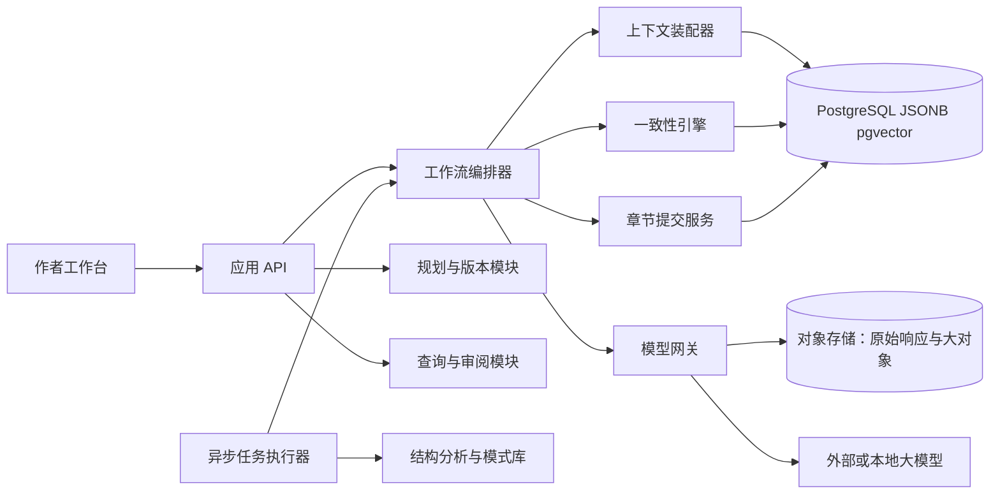
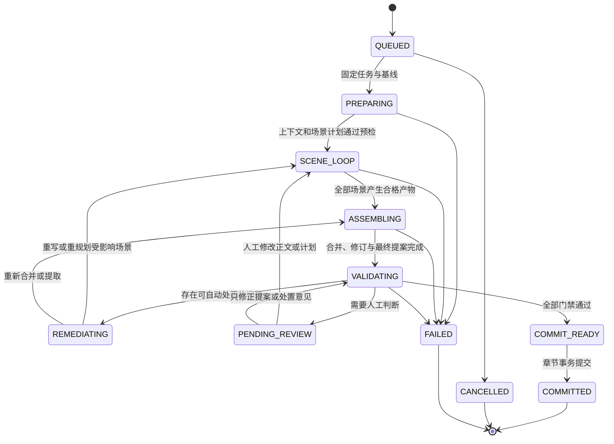
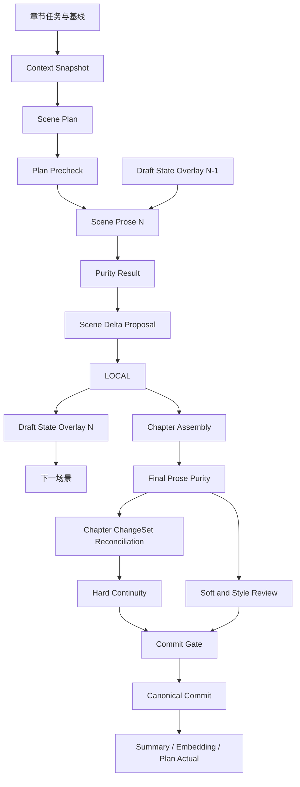

# 长篇网络小说创作系统：项目设计文档

> 文档状态：Draft v0.3  
> 更新日期：2026-08-12  
> 目标版本：MVP（单题材、3 卷、100 章）

## 1. 项目概述

本项目是一个接入大语言模型的长篇网络小说创作工作台。系统不把模型当作能够记住整本书的“自动作者”，而是把创作拆成规划、上下文装配、正文生成、事实提取、一致性校验和原子提交六类确定性步骤。

系统的核心可概括为：

> 大纲决定方向，事件账本保存历史，状态投影描述现在，伏笔与约束限定未来，章节事务让正文和记忆持续一致。

### 1.1 建设目标

MVP 需要做到：

1. 支持作品、分卷、剧情弧/事件、章节的分层规划，并允许以后无迁移地扩展到完整六层。
2. 生成单章 2,000～3,000 字正文，并在提交前提取新增事实和状态变化。
3. 可靠维护人物状态、事件、人物知识和伏笔，减少长篇创作中的设定冲突。
4. 对硬一致性执行确定性拦截，对软一致性给出评分、证据和修改建议。
5. 支持任意层级、字段或情节的锁定、版本化和局部重规划。
6. 所有模型产物可追溯、可审阅、可重试，不允许模型直接修改正式事实。

### 1.2 非目标

MVP 暂不追求：

- 无人监管地一次生成百万字完本小说；
- 复杂知识图谱、分布式多智能体协商或微服务集群；
- 自动抓取、保存或仿写受版权保护作品的正文；
- 同时覆盖所有网文题材和全部叙事结构；
- 将软质量评分包装成绝对客观的“好文判定器”。

### 1.3 MVP 验收指标

| 类别 | 指标 |
| --- | --- |
| 事实一致性 | 测试集中已知的地点、存亡、持有物、知识边界、时间线冲突召回率 ≥ 95% |
| 事务安全 | 校验未通过时，正式正文、事件和当前状态均不得部分写入 |
| 可追溯性 | 任一当前状态能追溯至产生它的章节、事件、状态变更和模型运行 |
| 锁定可靠性 | 硬锁字段未经显式解锁不可被生成或重规划流程修改 |
| 局部重规划 | 可从指定章节重新规划，且不修改此前已提交事实 |
| 可恢复性 | 相同幂等键重复执行提交，不产生重复事件或重复状态变更 |
| 人工控制 | 正文、事实提取、冲突处置和计划变更均有明确的审核入口 |
| 正文纯净度 | 已知思考过程、评价、提示词回显、前后说明和截断样本不得进入正式正文 |

质量类指标还需通过首批真实创作建立基线，不应在缺少样本时预设虚假精度。

## 2. 核心设计决策

### 2.1 六层规划使用统一树模型

完整规划包含作品、卷、剧情弧、事件、章节、场景六层。底层统一为 `planning_node`，通过节点类型、父子关系和顺序表达层级，而不是为每层建立一套完全不同的规划引擎。

| 层级 | 主要问题 | 核心产物 | MVP |
| --- | --- | --- | --- |
| 作品 | 讲什么，最终走向哪里 | 核心卖点、主题、结局、总主线 | 必须 |
| 卷 | 每阶段发生何种质变 | 分卷目标、阶段敌人、能力/关系变化 | 必须 |
| 剧情弧 | 一个矛盾怎样形成并解决 | 起因、升级、转折、高潮、余波 | 可选显式节点 |
| 事件 | 具体发生哪些关键变化 | 条件、过程、结果、状态变化 | 必须 |
| 章节 | 本章完成什么叙事任务 | 钩子、冲突、信息、情绪、悬念 | 必须 |
| 场景 | 正文如何落地 | 地点、人物、行动、对话、感官细节 | 生成时必须，可不长期精细维护 |

这样既保留完整六层语义，也允许 MVP 将剧情弧折叠进事件规划、将场景作为章节运行的临时产物。

规划遵循“双向闭环”：

- 向下分解：上层目标转化为下层可执行任务；
- 向上回写：已提交事件改变章节、剧情弧、卷和作品的实际进度与风险，不直接覆盖原始意图。

原始计划、当前预测和实际完成情况必须分字段保存，避免“回写”抹掉计划偏差。

### 2.2 历史与现在不能成为两个真相源

事件账本和状态库采用“账本 + 投影”关系：

- 已提交事件与状态变更是历史事实源，只追加、不静默改写；
- 当前状态是由已提交状态变更计算出的查询投影；
- 投影损坏时能够从快照加后续变更重建；
- 修正事实使用补偿事件，不直接改旧记录；
- 对真正的编辑性改稿，建立新修订版本并重新计算受影响投影。

正文是叙事表现，不是结构化事实的唯一来源。结构化事实也不能脱离正文独自成立；二者必须在同一章节事务中通过校验后共同提交。

### 2.3 明确事实优先级

发生冲突时按以下顺序处理：

1. 人工硬锁约束；
2. 已提交的世界规则和规范事实；
3. 已提交事件及其状态变更；
4. 当前状态投影；
5. 已批准规划与伏笔窗口；
6. 自动摘要和向量召回内容；
7. 模型本次生成或推断。

低优先级内容不得覆盖高优先级内容。摘要、嵌入和模型推断始终是派生信息，不能单独成为“小说真相”。

### 2.4 章节生成是应用层暂存提交，不是数据库分布式两阶段提交

“两阶段提交”在本系统中指业务语义：先暂存正文与变更提案，再校验并原子提交。MVP 的候选正文以不可变 PostgreSQL `text` artifact 保存，数据库事务同时切换正文修订、事件、事实和状态投影，因此不需要跨 PostgreSQL 与对象存储的分布式 2PC。对象存储中的供应商原始响应只用于审计，不是规范提交依赖。

模型只能产生 `change_set proposal`；只有提交服务能写入正式事件、状态、知识与伏笔账本。

### 2.5 锁定是正式约束，不是提示词备注

锁定对象可作用于：

- 整个规划节点；
- 对象的某个 JSON Pointer 字段；
- 某个章节范围；
- 结局、人物命运、能力上限等跨对象约束。

锁分为：

- `HARD`：自动流程不可越过，只能由用户显式解锁或新建修订；
- `SOFT`：允许提出变更，但必须显示影响并等待批准；
- `PINNED_FACT`：已发生事实，后续重规划只能兼容，不能逆向消除。

提示词中的“不要修改”只用于帮助模型；真正执行依靠数据库约束、提交前校验和乐观锁。

### 2.6 模型角色分离，执行编排确定化

拆书分析、总纲规划、章节编剧、正文作者、状态提取、连贯性审校和文风审校是逻辑角色，可以由同一个模型以不同的版本化提示词承担。

工作流由状态机驱动，每一步具有固定输入、结构化输出、超时、重试、版本和幂等键。模型之间不进行无边界自由讨论。

### 2.7 模式库只保存抽象规律和统计证据

热门作品分析器保存结构特征、统计分布、适用条件、风险和来源元数据，不保存足以复现单部作品的长篇表达或具体情节序列。

模式进入推荐库前至少满足：

- 来自多部作品或公共领域/获授权样本；
- 记录样本量、题材分布和置信区间；
- 通过近似度检查，避免推荐结果过度贴近单一来源；
- 模式是候选建议，不自动覆盖作者规划。

### 2.8 模型输出始终是不可信候选

严格 JSON Schema 只能保证外层结构，不能证明 `prose` 字符串内部一定是小说正文。因此系统采用三层控制：

1. **任务隔离**：规划、写作、提取和审校使用独立调用；正文作者调用不同时承担分析、自评或状态提取。
2. **协议隔离**：只接收供应商 API 中明确的最终文本/结构化输出项，不拼接推理项、工具调用、日志或未知事件。
3. **发布门禁**：正文进入事实提取和正式存储前，必须通过格式完整性、正文纯净度和截断检查。

提示词只用于降低污染概率，不能作为发布保证。系统不得自动用正则删除可疑开头后继续提交，因为这可能掩盖更深的混入或删掉合法叙事；检测失败应产生新候选稿或进入人工审核。

### 2.9 硬状态只允许一个权威投影

地点、存亡、唯一物品归属、能力获得等需要硬判定的当前状态，必须落在带外键、唯一约束和领域校验的类型化投影表中。同一事实不能同时把“物品持有人”和“人物物品栏”都作为可写真相；人物物品栏应由物品归属反向生成。

JSONB 当前状态只作为上下文装配使用的聚合读模型，或承载情绪、衣着、疲惫等柔性字段。历史事实仍来自事件账本；类型化投影和 JSONB 读模型都能由账本重建。

### 2.10 工作流由产物依赖驱动

章节状态机只表示整次运行的粗粒度阶段。真正的执行、恢复和失效传播以不可变产物及其依赖关系为准：上下文、场景计划、场景正文、纯净度结果、事实提案和审校结果都记录输入哈希。

上游产物变化时，只失效依赖它的下游产物。例如修正事实提取不应重写正文；正文修改则必须失效纯净度、事实提取和一致性校验。任何模型调用的成功都不等于工作流步骤成功，只有产物通过该步骤契约后才能推进。

## 3. 总体架构

MVP 采用模块化单体：一个应用进程可包含多个边界清晰的模块，异步任务通过队列执行，结构化数据集中在 PostgreSQL。



### 3.1 模块职责

| 模块 | 职责 | 不负责 |
| --- | --- | --- |
| 作者工作台 | 规划编辑、锁定、差异审阅、冲突处置、正文版本比较 | 直接写数据库 |
| 规划与版本模块 | 六层规划树、依赖、版本、局部重规划、影响分析 | 生成正式事实 |
| 工作流编排器 | 执行状态机、任务重试、幂等、暂停与恢复 | 自行判断小说真相 |
| 上下文装配器 | 按任务和预算确定性选取上下文、记录来源 | 生成正文 |
| 模型网关 | 供应商适配、结构化输出、限流、成本统计、提示词版本 | 业务提交 |
| 一致性引擎 | 硬规则判定、软评分、证据定位、修复建议 | 未经批准自动篡改事实 |
| 提交服务 | 校验版本、原子落账、更新投影、触发后续任务 | 规划生成 |
| 结构分析器 | 提取跨作品抽象模式和统计证据 | 保存或仿写作品正文 |

### 3.2 基础设施

| 组件 | MVP 选择 | 用途 |
| --- | --- | --- |
| PostgreSQL | 16+ | 事务、正式正文、结构化事实、JSONB、版本、工作流和审计 |
| pgvector | 与 PostgreSQL 同库 | 事件、摘要、场景和人物经历的语义召回 |
| 对象存储 | S3 兼容接口 | 供应商原始响应、导入材料、附件、导出包和冷大对象 |
| 任务队列 | 数据库队列或 Redis 队列二选一 | 长耗时模型调用、重试、摘要和嵌入任务 |
| 模型供应商 | 通过统一网关接入 | 规划、写作、提取、软审校 |

在任务规模和团队规模证明需要前，不拆微服务，不引入独立图数据库。

### 3.3 数据存储职责边界

| 存储形态 | 主要内容 | 是否规范真相 |
| --- | --- | --- |
| PostgreSQL 关系表 | 实体身份、事件、事实、知识、锁、工作流、类型化硬投影、版本与血缘 | 是，或可由账本重建的权威投影 |
| PostgreSQL `text` | MVP 正文、上下文编译内容、摘要、语义块原文和证据文本 | 正文是；其余按产物类型为派生 |
| PostgreSQL JSONB | 类型化规划详情、柔性状态、候选结构化产物、规则和供应商元数据 | 只有经过提交的明确字段可以成为规范内容 |
| pgvector | 已提交场景、事件、摘要和人物经历的语义索引 | 否，可删除重建 |
| 对象存储 | 原始模型响应、导入材料、附件、导出包和冷大对象 | 否，不参与章节规范提交 |

进入外键、唯一约束、范围查询、并发控制或硬一致性判断的字段必须关系化。JSONB 不保存可写的第二份硬状态；向量召回不承担事实判定；正式正文不依赖对象存储可用性。

## 4. 领域模型

详细表结构和 JSON Schema 见 [核心数据模型](CORE_DATA_MODEL.md)。本节只说明关键边界。

### 4.1 核心对象

| 对象 | 作用 |
| --- | --- |
| Work | 作品根对象、题材、目标长度、默认模型和语言 |
| WorkHead | 作品当前提交序号、状态版本和活动规划修订的并发控制点 |
| PlanningRevision | 一次完整规划快照及其来源、重规划边界和审批状态 |
| PlanningNode | 六层规划统一节点，保存意图、进度、预测和实际结果 |
| WorkflowRun / StepRun | 一次章节工作流及其步骤、尝试、租约、重试和恢复状态 |
| Artifact | 上下文、规划、正文、提案、审校、摘要等不可变产物的统一注册对象 |
| ArtifactDependency | 产物之间带输入版本和哈希的依赖边 |
| DraftStateOverlay | 当前章节内、尚未成为正式事实的场景状态覆盖层 |
| StoryEntity | 人物、地点、物品、势力、能力等稳定身份 |
| CanonicalFact | 原子规范事实及其证据、有效范围和置信状态 |
| Event | 已发生事件账本，区分故事时间和叙述出现顺序 |
| StateChange | 事件引起的可审计状态增量 |
| EntityContextState | 类型化硬投影与柔性状态编译出的当前上下文读模型 |
| TypedProjection | 地点、存亡、物品归属、能力等受数据库约束的硬状态投影 |
| KnowledgeState | 某人物对某事实是未知、怀疑、相信还是确知 |
| Foreshadow | 面向未来的线索、承诺、揭示窗口和生命周期 |
| MemoryPoint | 面向读者记忆的创作资产及首次出现、强化、变形、兑现生命周期 |
| ChapterRevision | 章节正文及其每次修订的不可变版本 |
| GenerationRun | 一次模型调用的输入来源、提示词、模型、成本和输出 |
| Constraint | 硬锁、软锁和已发生事实约束 |
| ValidationIssue | 可定位到证据的硬冲突或软质量风险 |

其中 `EVENT` 类型的规划节点表示未来意图，可以随规划修订；`Event` 账本记录表示正文已经发生并正式提交的事实，只追加。二者通过稳定的规划节点逻辑键关联，但绝不能共用生命周期或状态字段。

### 4.2 记忆点与伏笔的边界

两者可以关联但不合并：

- 记忆点关注“读者应该记住什么”，允许只有强化而没有谜底；
- 伏笔关注“未来必须解释或兑现什么”，必须有状态和时间窗口；
- “断剑重铸”可同时是核心意象记忆点和身份谜团伏笔，通过关联表连接；
- 生命周期记录使用独立 occurrence 表，避免把章节编号不断追加进单个 JSON 数组造成并发冲突。

### 4.3 时间的三种含义

长篇叙事必须区分：

1. `story_time`：故事世界中的发生时间；
2. `narrative_order`：读者在第几章、第几个场景得知；
3. `commit_time`：系统何时把它确认为正式事实。

倒叙只改变叙述顺序，不应无意中把历史事件当作“当前新发生事件”推进人物当前状态。MVP 对会追溯修改既有历史状态的倒叙提案强制人工审核。

## 5. 章节生产与提交工作流

### 5.1 章节运行状态机



章节状态不是步骤完成记录。每个步骤、尝试和产物还需要独立持久化，以支持服务重启、超时接管、局部重试和输入失效。

### 5.2 产物依赖图



`artifact_dependencies` 保存图中的边、来源版本、内容哈希和依赖作用。用户或模型修改上游产物后，系统沿依赖边把下游结果标为 `STALE`，不复用旧校验。

### 5.3 单章标准流程

1. **读取任务**：取得章节目标、依赖、锁定内容和期望状态变化。
2. **固定基线**：记录活动规划修订、正式提交序号、相关实体版本、规则包和提示词版本。
3. **装配上下文**：生成带完整渲染内容、来源 ID、版本、哈希和 token 估算的不可变上下文快照。
4. **生成全章场景计划**：输出场景目标、人物、地点、冲突、信息释放、前后依赖和预期变化。
5. **计划预检**：在写正文前检查地点、存亡、知识边界、道具、时间、能力限制和场景间依赖。
6. **初始化暂存覆盖层**：以章节基线状态为底，不复制或修改正式状态。
7. **顺序执行场景循环**：每个场景读取正式基线加此前场景的 `Draft State Overlay`，生成场景正文并执行纯净度门禁。
8. **提取场景增量**：从通过纯净度门禁的场景提取事件、状态和知识变化，局部校验后追加到暂存覆盖层。
9. **合并与文风修订**：处理转场、重复、人物声音和节奏；修订结果始终是新 artifact，不能假定“不改变事实”，并重新执行最终正文纯净度门禁。
10. **最终增量核对**：只对通过最终纯净度门禁的章节正文，将其事实与各场景增量合并结果双向核对；发生语义改动时重提取受影响范围，无法可靠定位时重提取全章。
11. **并行审校**：在依赖允许时并行执行硬一致性、软质量、伏笔/承诺、重复度和文风审校。
12. **问题路由**：根据问题来源回到提取、局部修订、场景正文、场景计划或上层重规划，而不是统一重写全章。
13. **原子提交**：检查基线和全部产物哈希后，同时写入正式正文、事件、事实、知识变化和投影。
14. **提交后任务**：通过事务 outbox 异步更新摘要、规划实际进度、未来计划影响和语义索引。

### 5.4 场景暂存状态

场景循环使用两类暂存数据：

- `draft_state_changes`：每个场景提出的只追加状态增量；
- `draft_current_states`：在当前 workflow 内由正式基线加暂存增量得到的快速查询投影。

它们都带 `workflow_run_id`，不能被正式上下文查询或其他章节读取。硬事件使用与正式提交相同版本的 projector 在隔离模式下模拟进 overlay，模型不能直接修改硬路径。下一场景的上下文明确标出哪些是正式事实、哪些只是本章已经写出但尚未提交的暂存事实。工作流失败或正文回退时，按产物依赖撤销并重放受影响场景之后的暂存增量。

章节仍是最小规范提交单元；不允许把单个场景提前写入正式事件账本。

### 5.5 问题处置路由

| 问题来源 | 默认处置 | 需要失效的下游产物 |
| --- | --- | --- |
| 响应格式、拒绝、截断、元话语 | 重新生成受影响场景 | 该场景纯净度、增量、覆盖层及后续场景 |
| 事实提取遗漏或误判 | 重新提取或人工修正提案 | 覆盖层、最终 change set、连续性校验 |
| 正文造成硬冲突 | 重写最小冲突场景 | 该场景之后的增量、合并稿和校验 |
| 场景计划违反设定 | 重规划该场景及依赖后继 | 受影响场景全部产物 |
| 文风或重复问题 | 局部修订并创建新正文 artifact | 纯净度、语义差异核对及相关校验 |
| 章节目标偏离 | 重规划整章 | 场景计划及全部下游 |
| 上层剧情已不可行 | 暂停章节并请求局部重规划 | 当前章节运行，不自动修改规范事实 |

若人工只修改 `change_set` 或问题处置状态，可以回到校验；若人工修改正文或计划，必须回到相应产物节点并让依赖结果失效。

### 5.6 提交不变量

每次正式提交必须满足：

- 章节修订与 `change_set` 一一对应；
- 工作流、场景产物、最终正文、`change_set` 和校验结果之间的依赖链完整；
- `change_set` 引用创建它的上下文快照、正式基线和模型运行；
- 所有相关前置状态版本与当前数据库版本相同；
- 没有未豁免的 `ERROR` 级硬冲突；
- 最终正文具有针对同一内容哈希的有效 `PURITY/PASSED` 门禁结果；
- 每个状态变化都绑定事件或显式的编辑修正原因；
- 所有硬锁仍成立；
- 暂存状态未被其他章节读取，也没有直接进入规范表；
- 同一幂等键只能产生一个提交结果。

若提交前已有其他操作改变相关状态，则标记为 `STALE_BASELINE`，重新检查实际读取集。MVP 可以安全地使整章重新装配；后续再根据 `context_items` 的来源版本缩小失效范围。

### 5.7 “秘密意外暴露”的处理示例

正文中主角无意说出只有少数人知道的暗号后，提取器提交的不是一句摘要，而是：

- 一个“暗号被说出”的事件；
- 在场人物列表和事件证据片段；
- 对各人物 `KnowledgeState` 的候选变化，例如 `UNKNOWN → SUSPECTS`；
- 主角对“秘密已暴露”这一事实仍为 `UNAWARE`；
- 相关伏笔从 `SET_UP → PARTIALLY_REVEALED`；
- 对未来三章计划的影响清单，而不是直接改写这些计划。

该增量先进入本章 `Draft State Overlay`，使下一场景知道配角已经开始怀疑；只有全章通过校验后才进入正式知识状态。校验器还要区分“听见暗号”“理解含义”和“确认主角身份”，避免把同处一室等同于完全知情。

## 6. 上下文装配

### 6.1 上下文包结构

单章上下文包至少包括：

```text
ContextPackage
├── task                 本章目标、禁区、期望变化
├── global_constraints   主题、结局、世界硬规则、锁定约束
├── active_plan          当前卷、剧情弧、事件与章节规划
├── current_state        相关实体的当前状态和状态版本
├── knowledge_matrix     在场人物的知识与误信
├── relevant_history     直接依赖事件 + 语义召回事件
├── future_obligations   即将到窗的伏笔、承诺、记忆点
├── recent_narrative     最近章节详细摘要及必要原文片段
├── style_contract       视角、语气、禁写规则和样例特征
└── provenance           每块内容的来源 ID、版本、哈希和 token 数
```

快照必须保存实际发送给模型的完整编译内容，或保存每个渲染块的内容寻址副本。仅保存来源版本和文本哈希不能复现已经被原地更新的当前状态。

### 6.2 召回顺序

先确定性检索，再进行语义检索：

1. P0：硬锁、世界规则、直接依赖、当前状态、知识边界；
2. P1：本章任务、活跃剧情弧、即将到期伏笔；
3. P2：参与人物和地点的最近关键事件；
4. P3：最近 2～3 章的详细摘要和必要原文；
5. P4：语义相似的旧事件、场景和人物经历。

向量召回前必须先执行元数据硬过滤：作品命名空间、规范状态、`commit_seq` 基线、当前章节边界和可揭示范围。不得召回未来章节、未提交候选、已被修订淘汰的正文或伏笔的隐藏答案。

向量召回结果必须携带来源，且不能覆盖 P0/P1 的结构化事实。作品记忆与跨作品模式库使用不同 namespace，默认不能混合检索。

MVP 每部作品只有数百到数千语义块，优先使用带元数据过滤的精确余弦查询；数据规模和延迟证明需要后再启用 HNSW。

### 6.3 预算策略

初始目标比例可采用：规划 20%、人物与世界状态 25%、历史 20%、近期正文 15%、指令和输出预留 20%。这些是目标值而非硬切片。

预算不足时按以下顺序压缩：

1. 去重并改用结构化紧凑表达；
2. 将远期历史原文替换为事件记录；
3. 将近期非关键原文替换为详细摘要；
4. 降低 P4 语义召回数量；
5. 仍超限则拆分场景生成，绝不删除硬约束。

每次生成保存实际装入项和遗漏原因，以便复现“模型当时知道什么”。

## 7. 一致性与质量控制

### 7.1 硬一致性

| 规则族 | 示例 | 判定方式 |
| --- | --- | --- |
| 存亡 | 已死亡人物无解释行动 | 当前状态 + 复活规则 |
| 地点 | 同一时刻出现在不可达地点 | 时间区间 + 地点 + 旅行规则 |
| 知识 | 人物使用尚未知悉的秘密 | KnowledgeState + 获知事件 |
| 持有物 | 同一唯一物品被多人持有 | 物品状态投影 + 唯一约束 |
| 能力 | 使用未获得能力或突破上限 | 能力状态 + 世界规则 |
| 时间 | 因果倒置、年龄或时长冲突 | 故事时间区间约束 |
| 锁定 | 改动硬锁结局或字段 | Constraint 校验 |
| 伏笔 | 在禁止揭示章节之前泄底 | reveal window + occurrence |

规则输出必须包含：规则 ID、严重度、冲突对象、数据库证据、正文证据和可选修复建议。硬规则以确定性代码为主，模型只辅助识别正文中的候选事实。

### 7.2 软一致性

软审校按维度分别评分，不只返回总分：

- 人物动机和行为可信度；
- 情绪变化的铺垫充分度；
- 冲突、升级与解决方式的重复度；
- 爽点、危机和揭秘的节奏；
- 人物对话声音区分度；
- 与当前卷主题及章节任务的对齐度；
- 读者承诺、伏笔和记忆点的维护情况；
- 文风契约符合度。

每个低分项必须引用正文片段和相关设定，并标注置信度。建议门禁：高置信严重风险进入人工审核，中低置信风险只提示，不自动判错。

### 7.3 硬规则豁免

世界观允许的复活、瞬移、不可靠叙述等例外必须先建成结构化规则或一次性豁免。豁免记录包含范围、理由、批准人和过期条件，不能通过在提示词里临时解释来绕过。

### 7.4 正文纯净度硬门禁

正文作者调用遵循“单一产物原则”：只生成一个场景或一章的小说正文，不要求它解释写法、列出变化、评价质量或先思考再作答。需要自检时由另一次审校调用完成，审校输出结构化问题列表，不能和正文拼接。

正文作者默认使用无聊天历史的单次调用。场景计划、人物状态和近期正文以有类型的数据块注入，并明确标记为参考数据；不把规划器、审校器的自然语言回答或上一轮失败稿的助手消息原样塞进对话历史。这样可以降低模型沿袭“分析—正文—点评”回答模式或执行数据中指令式文本的概率。

推荐的供应商无关输出契约为：

```json
{
  "schemaVersion": 1,
  "artifactType": "SCENE_PROSE",
  "sceneId": "<uuid>",
  "prose": "<仅小说正文>"
}
```

该契约解决 JSON 外部多余文本、字段缺失和输出类型混杂，但 `prose` 内仍需语义检查。正文门禁分四步：

1. **传输与类型检查**：只读取已知的最终消息/结构化输出项；未知输出类型直接隔离，不按字符串拼接。
2. **结构与完整性检查**：验证 schema、响应完成状态、拒绝状态、结束原因、长度区间、JSON 完整性和对象哈希。
3. **确定性污染扫描**：检查代码围栏、JSON/Markdown 包装、提示词片段、角色标签、常见元话语、占位符、异常首尾和重复前缀。规则必须结合位置与结构，不能仅凭正文中出现“分析”“本章”等词判错。
4. **独立语义审校**：另一次模型调用只返回污染类别、置信度和字符区间，检测思考过程、自我评价、创作说明、摘要代替正文、对用户说话及隐蔽提示词回显。它无权改写正文或给出通过后的新正文。

建议污染类别：

- `PREAMBLE`：例如“以下是正文”；
- `POSTSCRIPT`：写作说明、总结、请求反馈；
- `REASONING_LEAK`：分析、权衡、反思过程；
- `SELF_EVALUATION`：对本章节奏、人物、完成度的评价；
- `PROMPT_ECHO`：复述任务、场景计划或禁写规则；
- `NON_PROSE_WRAPPER`：Markdown 标题、代码围栏、JSON 残片或角色标签；
- `PLACEHOLDER`：TODO、省略待补、模板变量；
- `REFUSAL_OR_TRUNCATION`：拒绝、内容过滤或未正常完成；
- `SUMMARY_INSTEAD_OF_SCENE`：用梗概代替实际叙事。

处置策略：

- 结构失败、拒绝、截断或高置信污染：候选稿标记 `REJECTED`，重新生成；
- 疑似污染：进入人工审核，默认不可提交；
- 低置信风格问题：进入普通文风审校，不应误用纯净度门禁；
- 任意清洗、局部重写都会产生新的不可变候选和新哈希，旧门禁结果不得复用。

流式输出只能作为带“未验证”标识的预览。服务端必须缓存在隔离区，收到完成事件并通过门禁后才能成为可供事实提取的正文版本，不能边生成边写入正式章节。

## 8. 局部重规划与版本控制

用户提出“从第 80 章以后重新规划，但不能影响前文事实”时，系统执行：

1. 将第 1～79 章已提交事件、事实、状态变化标为前置规范事实；
2. 计算第 79 章末的状态快照、未兑现伏笔和硬锁结局；
3. 复制第 80 章起的规划为新修订分支，旧版本仍可查看；
4. 基于新目标生成候选规划；
5. 执行反向影响分析：是否要求改写前文、违反已知信息或让既有伏笔失效；
6. 对冲突项给出“保留、补偿、显式废弃或请求解锁”的选择；
7. 用户批准后把新分支设为活动规划，不修改已提交正文。

已写章节若需要改稿，则属于“规范修订”，必须显式选择影响范围，重放其后的状态投影并重新校验下游章节；不能伪装成普通重规划。

## 9. 热门作品结构分析与模式库

### 9.1 分析流水线

```text
合法输入/授权文本
  → 章节边界与实体识别
  → 结构特征提取
  → 单书统计与不确定性标注
  → 跨书聚合、聚类和离群检查
  → 人工命名与适用条件审核
  → 模式库
```

建议提取的可比特征包括：

- 建立核心期待所需章节数；
- 主角初始缺口、欲望和阻力类型；
- 爽点、危机、揭秘的间隔分布，而非单一平均值；
- 各卷矛盾范围、能力层级和关系网络的变化；
- 配角加入、背叛、退场所在的相对进度；
- 伏笔从埋设到强化、部分揭示、兑现的时长分布；
- 记忆点类型及重复强化方式；
- 中后期升级的变化维度；
- 最终高潮回收的前期承诺比例。

### 9.2 模式对象

模式包含名称、适用题材、前置条件、结构步骤、节奏分布、预期效果、风险、反模式、样本量、来源范围和置信度。推荐时还要记录“为什么适合当前作品”和“与已使用模式是否重复”。

模式库属于后续增强功能，不阻塞章节闭环 MVP。

## 10. API 与异步任务边界

MVP 可采用 REST API；所有会触发长模型调用的接口返回 `job_id`。

| 操作 | 建议接口 |
| --- | --- |
| 创建/查询作品 | `POST /works`、`GET /works/{id}` |
| 编辑规划树 | `POST /works/{id}/planning-nodes`、`PATCH /planning-nodes/{id}` |
| 创建锁 | `POST /works/{id}/constraints` |
| 发起局部重规划 | `POST /works/{id}/replans` |
| 发起章节生成 | `POST /chapters/{id}/workflow-runs` |
| 查看/恢复章节工作流 | `GET /workflow-runs/{id}`、`POST /workflow-runs/{id}/resume` |
| 查看步骤与生成候选 | `GET /workflow-runs/{id}/steps`、`GET /generation-runs/{id}` |
| 修正变更提案 | `PATCH /change-sets/{id}` |
| 执行校验 | `POST /change-sets/{id}/validations` |
| 提交章节事务 | `POST /change-sets/{id}/commit` |
| 查询当前状态 | `GET /works/{id}/states` |
| 查看对象历史 | `GET /entities/{id}/timeline` |

当前可运行的写作纵切已经实现作品、章节、正文与候选生成接口，具体路径和前端加载策略见 [本地写作工作台设计](WRITING_WORKSPACE.md)。目标完整工作流接口仍按上表逐步扩展，不通过把未实现的事实提交伪装成“章节发布”来缩短流程。

写接口要求：

- 携带 `Idempotency-Key`；
- 更新携带 `expected_version`；
- 返回审计 ID 和新版本；
- 提交接口不得接受未经校验的客户端自报状态。

### 10.1 模型网关契约

每次调用记录：任务角色、模型供应商与精确快照版本、温度等参数、提示词模板版本、输入上下文快照、结构化输出 schema 版本、响应项类型、完成/拒绝/截断状态、token、成本、耗时、重试链和安全过滤结果。

供应商切换不改变领域对象，只改变模型配置。网关为每个模型维护能力矩阵，至少区分严格结构化输出、响应项类型、流式完成事件、拒绝识别和快照固定能力。不能满足正文输出契约的模型不得作为生产正文作者的默认模型。

规划、提取和审校类结构化输出若 schema 失败，可做一次受限的 JSON 修复；正文输出不得通过“格式修复器”顺便改写 `prose`。任何正文字符变化都必须形成新候选并重新走门禁。

初期正式供应商实现为 OpenAI 与 DeepSeek，另提供本地开发测试专用的 `openai_codex_session`，详细契约见 [模型供应商接入设计](PROVIDER_INTEGRATION.md)。OpenAI 使用 Responses API 的严格 JSON Schema；DeepSeek 使用 Chat Completions JSON Output；Codex 会话通过官方 CLI 复用当前用户的 ChatGPT 登录，但不得进入生产、多租户或无人值守部署。三者都强制执行本地 schema 二次校验。`chatgpt` 仍只作为 OpenAI API 的路由别名，订阅通道必须显式选择，避免误用和计费混淆。

供应商的推理内容与最终文本必须按原生响应字段隔离。OpenAI 只读取 assistant message 的 `output_text`，DeepSeek 只读取 `message.content`，Codex 会话只读取 `--output-last-message` 文件；reasoning item、`reasoning_content`、CLI 事件流、工具调用和未知响应项不得拼接到正文。Codex 会话一旦产生工具项即拒绝结果，并以临时空目录、只读沙箱、无审批、无用户配置的方式运行。适配器不做隐式重试，是否重试由持久化工作流根据规范化错误类型和 attempt 记录决定。

由 HTTP 发起的长模型调用不得在 Web 进程内执行。服务先持久化 workflow run 和全部步骤，再启动独立 worker；页面轮询数据库中的状态。worker 只能把通过输出契约和确定性正文门禁的结果保存为待审修订，不能直接发布规范正文。生产扩展时以持久队列、租约和心跳替换本地进程启动，但不改变任务先落库的边界。

### 10.2 提示词目录与发布契约

核心提示词是受版本控制的产品资产，统一存放在：

```text
src/novel_ai/prompts/catalog/<prompt_key>/v<version>/
  manifest.json
  system.md
  user.md
  schema.json
```

`manifest.json` 声明逻辑角色、必需模板变量、输出模式和 schema 路径。加载器启动时双向核对模板中实际变量与清单，缺失变量、额外变量、目录名和版本号不一致都直接失败。渲染必须经过统一 renderer，业务代码禁止内联长提示词或自行使用 f-string、`str.format` 拼装。

发布后的版本目录只读；行为调整新建版本。`generation_run` 与 `context_snapshot` 同时记录 `prompt_key`、整数版本和基于 manifest、system、user、schema 全部内容计算的 SHA-256 指纹，避免版本标签未变而实际内容漂移。模型选择、温度、密钥和供应商能力放在运行配置，不进入提示词正文。

首批提示词角色为场景规划、场景正文、章节文风修订、正文纯净度审校、状态提取和连贯性审校。正文生产与审校严格分调用；纯净度审校只能返回类别、证据区间和决定，不能返回“修正后的正文”。

## 11. 安全、版权与可观测性

### 11.1 安全与隐私

- 作品按租户/用户隔离，所有查询带 `work_id` 和授权校验；
- 模型调用前按供应商策略处理私密内容和个人信息；
- API 密钥进入密钥管理服务，不写数据库明文或日志；
- 对象存储使用短期签名 URL；
- 审计日志只追加，记录人工解锁、豁免和规范修订。

### 11.2 版权边界

- 只分析用户有权使用、公共领域或已获授权的全文；
- 默认不长期保存第三方完整正文；
- 模式库保存抽象结构特征和统计，不保存可还原原作的连续表达；
- 生成前可执行与来源样本的高相似片段检查；
- “模仿某在世作者”请求应转化为高层风格特征，而非复刻独特表达。

### 11.3 可观测性

至少记录：

- 每类模型任务的成功率、结构化输出修复率、延迟、token 和成本；
- 上下文命中项、被裁剪项和 token 分布；
- 各硬规则触发次数、误报处置和漏报回归样本；
- 正文污染检出率、污染逃逸率、误拒率、截断率和因此触发的重写次数；
- 章节平均重写次数、人工修改比例和提交耗时；
- 步骤重试率、局部失效范围、全章返工率和暂存覆盖层重放耗时；
- 状态投影重建校验结果；
- 伏笔逾期、过早揭示和长期未强化数量。

日志、指标和模型输入输出通过同一个 `correlation_id` 串联。

## 12. MVP 范围与交付计划

### 12.1 MVP 范围

- 单一题材模板；
- 3 卷、最多 100 章，每章目标 2,000～3,000 字；
- 完整支持作品、卷、事件、章节四级持久规划；
- 剧情弧节点可用，场景计划作为章节运行产物；
- 人物/物品/地点基础状态、事件、人物知识、伏笔三类核心记忆；
- 章节生成、事实提取、硬一致性检查、软审校和事务提交；
- 节点/字段硬锁、软锁、从指定章节局部重规划；
- 基础版本历史、差异审阅、回滚到旧规划版本；
- PostgreSQL 关系表 + `text` + JSONB + pgvector；对象存储只承载原始响应和大对象。

模式库、自动跨作品统计、高级关系图谱、多作者实时协作放在 MVP 之后。

### 12.2 建议迭代顺序

| 阶段 | 交付物 | 退出条件 |
| --- | --- | --- |
| 0. 技术验证 | 模型结构化输出、正文纯净度门禁、上下文预算、正文与事实同库提交 PoC | 结构化输出稳定；已知污染不逃逸；失败可恢复 |
| 1. 事实底座 | 事件账本、类型化硬投影、柔性状态读模型、锁定、审计 | 可手工录入事件并重建相同硬状态和上下文状态 |
| 2. 规划工作台 | 规划树、版本、依赖、局部重规划影响分析 | 80 章后重规划用例通过 |
| 3. 章节闭环 | 持久化工作流、场景覆盖层、产物依赖、正文、提取、校验、提交 | 可从任一步骤恢复并安全提交 10 章 |
| 4. 质量与规模 | 软审校、摘要、向量召回、成本监控 | 连续 100 章压力与回归测试通过 |
| 5. 模式库 | 合法语料分析、跨书统计、推荐 | 样本与置信度可解释，近似度门禁通过 |

### 12.3 首批关键测试场景

1. 人物跨城但旅程时间不足，提交被拒绝。
2. 已死亡人物在无复活规则时说话，提交被拒绝。
3. 偷听者只听到暗号，不自动获得暗号含义的完整知识。
4. 唯一道具转移后，旧持有人状态同步失去道具。
5. 伏笔在 `must_not_reveal_before` 前被正文揭底，提交被拒绝。
6. 同一章节提交请求重试两次，只产生一次事件和一个正文版本。
7. 生成期间人物状态被其他操作更新，旧提案因基线过期不能提交。
8. 从第 80 章重规划，1～79 章事实与状态不变。
9. 硬锁结局与候选规划冲突，系统展示冲突路径而不是静默改结局。
10. 删除并重建当前状态投影，结果与删除前一致。
11. 模型在正文前输出“以下是正文”或在结尾自评，候选稿被纯净度门禁拒绝。
12. 原始响应同时包含推理/工具项和最终文本时，只有契约指定的最终文本进入候选正文。
13. 流式生成中途断开或结束原因为长度限制时，片段不得进入事实提取。
14. 合法对白中出现“让我分析一下”时，位置与语义审校避免简单关键词误拒。
15. 第一场景转移道具后，第二场景从暂存覆盖层看见新归属，但其他章节仍只能看见正式旧状态。
16. 人工只修正事实提案时不重写正文；人工修改正文后旧提取与校验结果全部因依赖哈希失效。
17. 向量查询无法召回当前章节之后或 `must_not_reveal_before` 尚未满足的内容。
18. 工作进程在第三场景后中断，重新启动后从最后一个有效步骤恢复，不重复提交已完成产物。

## 13. 待验证决策

编码前通过阶段 0 原型确认：

- 首选后端语言与框架；
- 模型供应商、上下文长度、结构化输出稳定性和单位章节成本；
- 数据库队列是否足够，还是直接使用 Redis 队列；
- 正文历史版本达到何种规模后需要把冷 artifact 迁移到对象存储；
- 单章分场景调用次数与可接受延迟；
- 单题材模板和首批质量评测集；
- 哪些软评分需要人工标注样本校准。

这些决策不改变本文的领域边界和提交不变量，可以在 PoC 后写入 ADR（Architecture Decision Record）。

## 14. 设计结论

本系统真正的难点不是“让模型写出一章”，而是保证每章对历史、现在和未来的改动都可识别、可校验、可追溯。MVP 应优先打通一个可靠的章节事务闭环，再扩充模式分析、题材覆盖和自动化程度。

推荐的实现重心依次是：规范事实与事件账本、状态投影、锁定和版本、章节事务、上下文装配、一致性评测，最后才是大规模自动生成。
